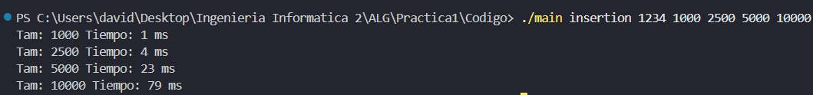
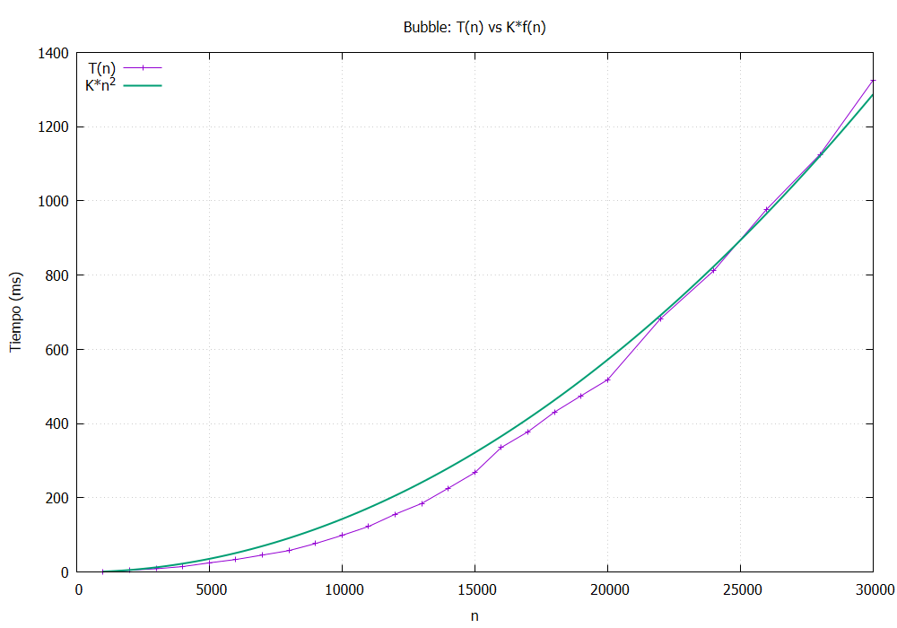
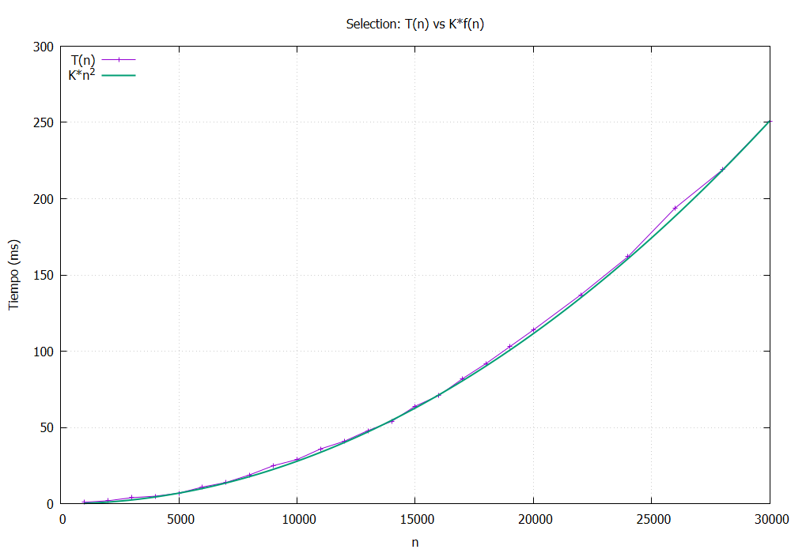
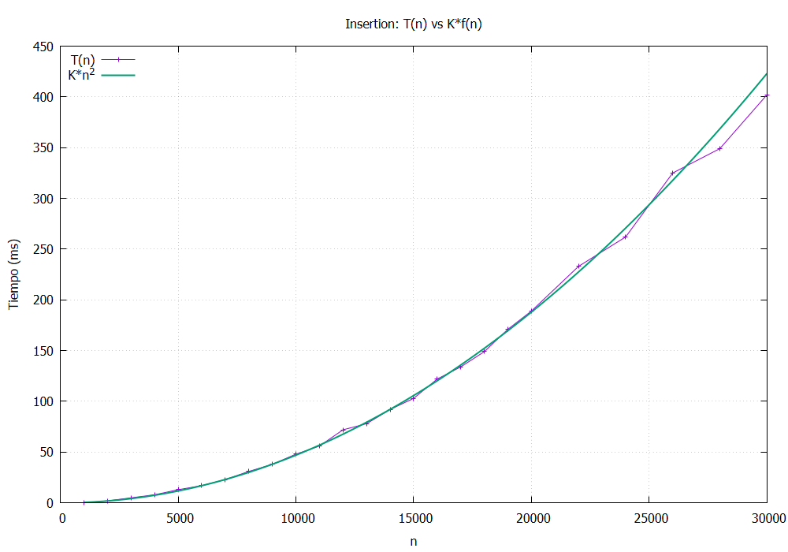
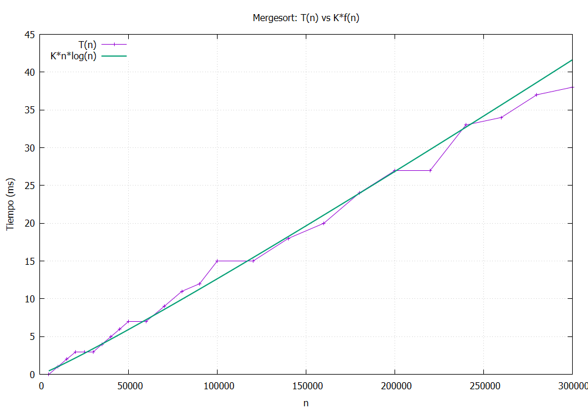
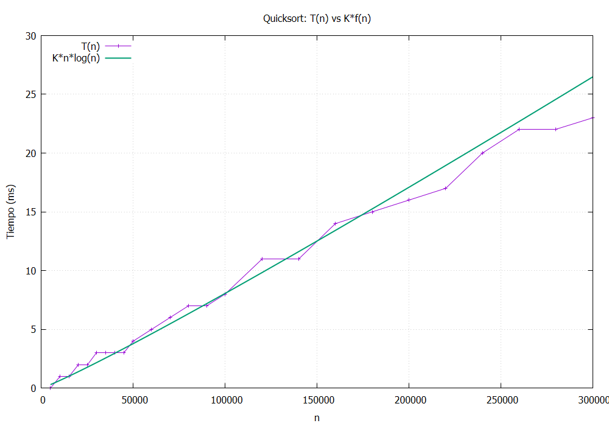
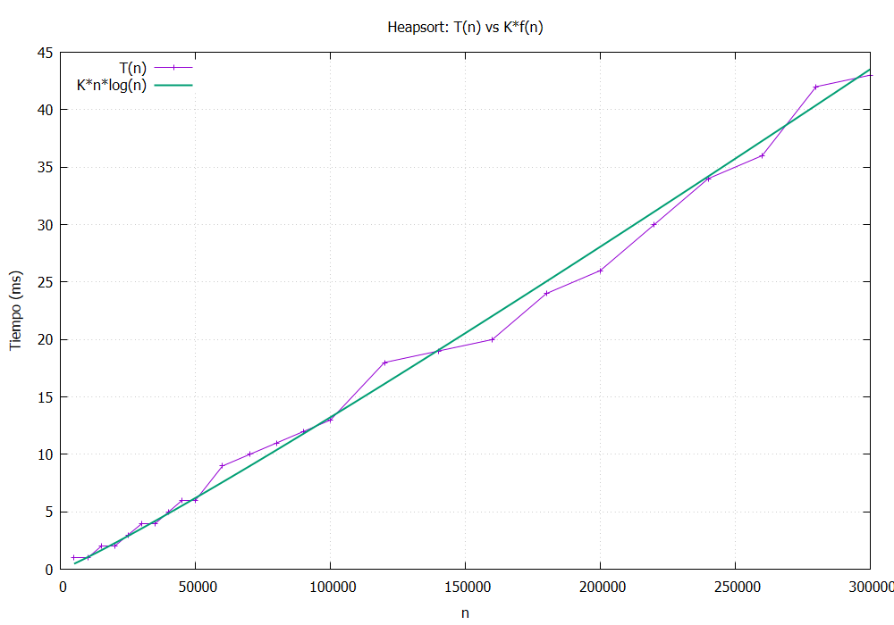
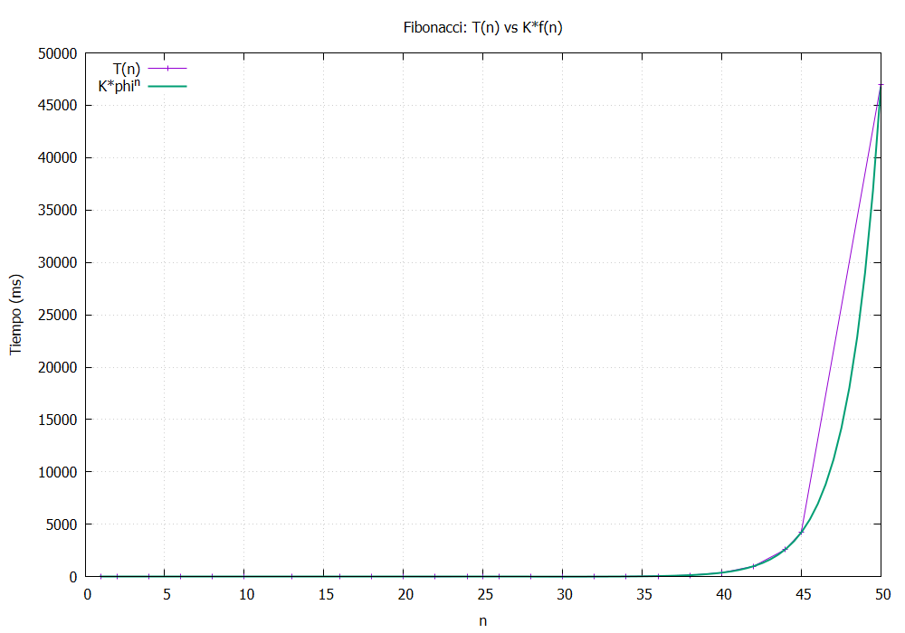
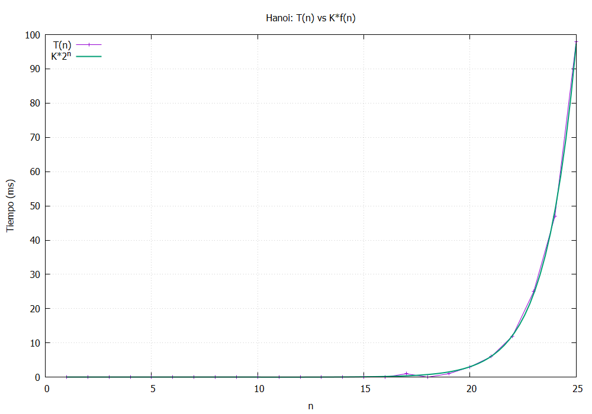

# **PRACTICA 1 - ALGORITMICA**

### **EJERCICIO 1**

He creado el código añadiendo el resto de algoritmos mediante includes, y en base a los parametros de entrada se elige una función u otra.

```c++

/* Archivos con funciones */

#include "bubble.cpp"
#include "insertion.cpp"
#include "selection.cpp"
#include "mergesort.cpp"
#include "quicksort.cpp"
#include "heapsort.cpp"
#include "fibonacci.cpp"
#include "hanoi.cpp"


#include <iostream>
#include <cstdlib>
#include <ctime>
#include <fstream>
#include <string>
#include <cstring>

using namespace std;


int main(int argc, char *argv[]) {

	if (argc <= 3) {
        cerr << "Error: El programa se debe ejecutar de la siguiente forma:\n";
        cerr << argv[0] << " NombreAlgoritmo Semilla tamCaso1 tamCaso2 ... tamCasoN\n";
        return 0;
    }

	int *vectorAlgoritmo;
    int tam, i;
    unsigned long int tiempoInicio, tiempoFin;
    double tiempoEjecucion;
    unsigned long int semilla;
    ofstream fsalida;
    string algoritmo;

	algoritmo = argv[1];
	
	fsalida.open("../dat/" + algoritmo + ".dat");
    if (!fsalida.is_open()) {
        cerr << "Error: No se pudo abrir el fichero " << algoritmo << ".dat\n";
        return 0;
    }

	semilla = atoi(argv[2]);
    srand(semilla);

	for (int argumento = 3; argumento < argc; argumento++) {

		tam = atoi(argv[argumento]);

		vectorAlgoritmo = new int[tam];

		for (i = 0; i < tam; i++) {
			vectorAlgoritmo[i] = rand() % tam;
		}

		tiempoInicio = clock();

		if (algoritmo == "bubble")
			bubble(vectorAlgoritmo, tam);

		else if (algoritmo == "insertion")
			insertion(vectorAlgoritmo, tam);

		else if (algoritmo == "selection")
			seleccion(vectorAlgoritmo, tam);

		else if (algoritmo == "mergesort")
			mergesort(vectorAlgoritmo, tam);

		else if (algoritmo == "quicksort")
			quicksort(vectorAlgoritmo, tam);

		else if (algoritmo == "heapsort")
			heapsort(vectorAlgoritmo, tam);

		else if (algoritmo == "fibonacci")
			fibo(tam);

		else if (algoritmo == "hanoi")
			hanoi(tam, 1, 2);

		else {
			cerr << "Algoritmo no reconocido\n";
			return 0;
		}

		tiempoFin = clock();

		tiempoEjecucion = 1000.0 * (tiempoFin - tiempoInicio) / CLOCKS_PER_SEC;

		fsalida << tam << " " << tiempoEjecucion << "\n";

		cerr << "Tam: " << tam << " Tiempo: " << tiempoEjecucion << " ms" << endl;

		delete[] vectorAlgoritmo;

	}

	fsalida.close();
	return 0;


}

```



### **EJERCICIO 2**

En este ejercicio hemos ejecutado cada algoritmo con una serie de parametros y la semilla 1333. En la carpeta cap están todos los resultados, no pongo las imagenes ya que los resultados se usan en las tablas del Ejercicio 3.


### **EJERCICIO 3**

- **BUBBLE (n^2)**

| n     | T(n) ms | f(n) operaciones | K(n) ms/operacion |
|-------|--------|------------------|----------------|
| 1000  | 1      | 1000000          | 0.000001       |
| 2000  | 5      | 4000000          | 0.00000125     |
| 3000  | 9      | 9000000          | 0.000001       |
| 4000  | 15     | 16000000         | 0.0000009375   |
| 5000  | 25     | 25000000         | 0.000001       |
| 6000  | 34     | 36000000         | 0.0000009444   |
| 7000  | 46     | 49000000         | 0.0000009388   |
| 8000  | 58     | 64000000         | 0.00000090625  |
| 9000  | 77     | 81000000         | 0.0000009506   |
| 10000 | 99     | 100000000        | 0.00000099     |
| 11000 | 123    | 121000000        | 0.0000010165   |
| 12000 | 156    | 144000000        | 0.0000010833   |
| 13000 | 185    | 169000000        | 0.0000010946   |
| 14000 | 226    | 196000000        | 0.0000011530   |
| 15000 | 268    | 225000000        | 0.0000011911   |
| 16000 | 336    | 256000000        | 0.0000013125   |
| 17000 | 378    | 289000000        | 0.0000013079   |
| 18000 | 431    | 324000000        | 0.0000013302   |
| 19000 | 475    | 361000000        | 0.0000013158   |
| 20000 | 518    | 400000000        | 0.000001295    |
| 22000 | 683    | 484000000        | 0.0000014111   |
| 24000 | 812    | 576000000        | 0.0000014097   |
| 26000 | 978    | 676000000        | 0.0000014467   |
| 28000 | 1125   | 784000000        | 0.000001435    |
| 30000 | 1325   | 900000000        | 0.0000014722   |


- **SELECTION (n^2)**
  
|   n   | T(n) ms | f(n) operaciones |      K(n)=T(n)/f(n)      |
|:-----:|--------:|-----------------:|-------------------------:|
|  1000 |       1 |         1000000  | 0.000001                 |
|  2000 |       2 |         4000000  | 0.0000005                |
|  3000 |       4 |         9000000  | 0.0000004444444444       |
|  4000 |       5 |        16000000  | 0.0000003125             |
|  5000 |       7 |        25000000  | 0.00000028               |
|  6000 |      11 |        36000000  | 0.0000003055555556       |
|  7000 |      14 |        49000000  | 0.0000002857142857       |
|  8000 |      19 |        64000000  | 0.000000296875           |
|  9000 |      25 |        81000000  | 0.0000003086419753       |
| 10000 |      29 |       100000000  | 0.00000029               |
| 11000 |      36 |       121000000  | 0.0000002975206612       |
| 12000 |      41 |       144000000  | 0.0000002847222222       |
| 13000 |      48 |       169000000  | 0.0000002840236686       |
| 14000 |      54 |       196000000  | 0.0000002755102041       |
| 15000 |      64 |       225000000  | 0.0000002844444444       |
| 16000 |      71 |       256000000  | 0.00000027734375         |
| 17000 |      82 |       289000000  | 0.0000002837370242       |
| 18000 |      92 |       324000000  | 0.0000002839506173       |
| 19000 |     103 |       361000000  | 0.0000002853185596       |
| 20000 |     114 |       400000000  | 0.000000285              |
| 22000 |     137 |       484000000  | 0.0000002830578512       |
| 24000 |     162 |       576000000  | 0.00000028125            |
| 26000 |     194 |       676000000  | 0.0000002869822485       |
| 28000 |     219 |       784000000  | 0.0000002793367347       |
| 30000 |     251 |       900000000  | 0.0000002788888889       |

- **INSERTION (n^2)**
  
|   n   | T(n) ms | f(n) operaciones |    K(n) ms/operacion     |
|-------|---------|------------------|--------------------------|
|  1000 |       0 |         1000000  | 0                        |
|  2000 |       2 |         4000000  | 0.0000005                |
|  3000 |       5 |         9000000  | 0.0000005555555556       |
|  4000 |       8 |        16000000  | 0.0000005                |
|  5000 |      13 |        25000000  | 0.00000052               |
|  6000 |      17 |        36000000  | 0.0000004722222222       |
|  7000 |      23 |        49000000  | 0.0000004693877551       |
|  8000 |      31 |        64000000  | 0.000000484375           |
|  9000 |      38 |        81000000  | 0.0000004691358025       |
| 10000 |      48 |       100000000  | 0.00000048               |
| 11000 |      56 |       121000000  | 0.0000004628099174       |
| 12000 |      72 |       144000000  | 0.0000005                |
| 13000 |      78 |       169000000  | 0.0000004615384615       |
| 14000 |      92 |       196000000  | 0.0000004693877551       |
| 15000 |     103 |       225000000  | 0.0000004577777778       |
| 16000 |     122 |       256000000  | 0.0000004765625          |
| 17000 |     134 |       289000000  | 0.0000004636678201       |
| 18000 |     149 |       324000000  | 0.0000004598765432       |
| 19000 |     171 |       361000000  | 0.0000004736842105       |
| 20000 |     189 |       400000000  | 0.0000004725             |
| 22000 |     233 |       484000000  | 0.0000004814049587       |
| 24000 |     262 |       576000000  | 0.0000004548611111       |
| 26000 |     325 |       676000000  | 0.0000004807692308       |
| 28000 |     349 |       784000000  | 0.0000004451530612       |
| 30000 |     402 |       900000000  | 0.0000004466666667       |

- **MERGESORT (n * log n)**

|    n   | T(n) ms | f(n) operaciones |      K(n)=T(n)/f(n)      |
|:------:|--------:|-----------------:|-------------------------:|
|   5000 |       0 |      42585.96596 | 0                        |
|  10000 |       1 |      92103.40372 | 0.00001085736205         |
|  15000 |       2 |     144237.0822  | 0.00001386605975         |
|  20000 |       3 |     198069.7511  | 0.00001514617949         |
|  25000 |       3 |     253165.7776  | 0.00001184994287         |
|  30000 |       3 |     309268.5798  | 0.000009700306451        |
|  35000 |       4 |     366208.6169  | 0.00001092273588         |
|  40000 |       5 |     423865.3893  | 0.00001179619786         |
|  45000 |       6 |     482148.7996  | 0.00001244429107         |
|  50000 |       7 |     540988.9142  | 0.00001293926699         |
|  60000 |       7 |     660125.9905  | 0.00001060403635         |
|  70000 |       9 |     780937.5365  | 0.00001152460931         |
|  80000 |      11 |     903182.5531  | 0.00001217915466         |
|  90000 |      12 |    1026680.845   | 0.00001168815027         |
| 100000 |      15 |    1151292.546   | 0.00001302883446         |
| 120000 |      15 |    1403429.643   | 0.00001068810259         |
| 140000 |      18 |    1658915.678   | 0.00001085046108         |
| 160000 |      20 |    1917268.655   | 0.00001043150627         |
| 180000 |      24 |    2178128.183   | 0.00001101863526         |
| 200000 |      27 |    2441214.529   | 0.00001106006853         |
| 220000 |      27 |    2706304.222   | 0.000009976705422        |
| 240000 |      33 |    2973214.609   | 0.00001109909789         |
| 260000 |      34 |    3241793.597   | 0.00001048802121         |
| 280000 |      37 |    3511912.567   | 0.00001053556981         |
| 300000 |      38 |    3783461.326   | 0.00001004371308         |
  


- **QUICKSORT (n * log n)**

|    n   | T(n) ms | f(n) operaciones |      K(n)=T(n)/f(n)      |
|:------:|--------:|-----------------:|-------------------------:|
|   5000 |       0 |      42585.96596 | 0                        |
|  10000 |       1 |      92103.40372 | 0.00001085736205         |
|  15000 |       1 |     144237.0822  | 0.000006933029875        |
|  20000 |       2 |     198069.7511  | 0.00001009745299         |
|  25000 |       2 |     253165.7776  | 0.00000789996191         |
|  30000 |       3 |     309268.5798  | 0.000009700306451        |
|  35000 |       3 |     366208.6169  | 0.000008192051911        |
|  40000 |       3 |     423865.3893  | 0.000007077718718        |
|  45000 |       3 |     482148.7996  | 0.000006222145534        |
|  50000 |       4 |     540988.9142  | 0.000007393866852        |
|  60000 |       5 |     660125.9905  | 0.00000757431168         |
|  70000 |       6 |     780937.5365  | 0.00000768307287         |
|  80000 |       7 |     903182.5531  | 0.000007750371147        |
|  90000 |       7 |    1026680.845   | 0.000006818087657        |
| 100000 |       8 |    1151292.546   | 0.00000694871171         |
| 120000 |      11 |    1403429.643   | 0.0000078379419          |
| 140000 |      11 |    1658915.678   | 0.000006630837326        |
| 160000 |      14 |    1917268.655   | 0.00000730205439         |
| 180000 |      15 |    2178128.183   | 0.000006886647037        |
| 200000 |      16 |    2441214.529   | 0.000006554114687        |
| 220000 |      17 |    2706304.222   | 0.00000628162934         |
| 240000 |      20 |    2973214.609   | 0.000006726725996        |
| 260000 |      22 |    3241793.597   | 0.000006786366665        |
| 280000 |      22 |    3511912.567   | 0.000006264392857        |
| 300000 |      23 |    3783461.326   | 0.000006079089494        |


- **HEAPSORT (n * log n)**

|    n   | T(n) ms | f(n) operaciones |      K(n)=T(n)/f(n)      |
|:------:|--------:|-----------------:|-------------------------:|
|   5000 |       1 |      42585.96596 | 0.00002348191423         |
|  10000 |       1 |      92103.40372 | 0.00001085736205         |
|  15000 |       2 |     144237.0822  | 0.00001386605975         |
|  20000 |       2 |     198069.7511  | 0.00001009745299         |
|  25000 |       3 |     253165.7776  | 0.00001184994287         |
|  30000 |       4 |     309268.5798  | 0.00001293374194         |
|  35000 |       4 |     366208.6169  | 0.00001092273588         |
|  40000 |       5 |     423865.3893  | 0.00001179619786         |
|  45000 |       6 |     482148.7996  | 0.00001244429107         |
|  50000 |       6 |     540988.9142  | 0.00001109080028         |
|  60000 |       9 |     660125.9905  | 0.00001363376102         |
|  70000 |      10 |     780937.5365  | 0.00001280512145         |
|  80000 |      11 |     903182.5531  | 0.00001217915466         |
|  90000 |      12 |    1026680.845   | 0.00001168815027         |
| 100000 |      13 |    1151292.546   | 0.00001129165653         |
| 120000 |      18 |    1403429.643   | 0.00001282572311         |
| 140000 |      19 |    1658915.678   | 0.00001145326447         |
| 160000 |      20 |    1917268.655   | 0.00001043150627         |
| 180000 |      24 |    2178128.183   | 0.00001101863526         |
| 200000 |      26 |    2441214.529   | 0.00001065043637         |
| 220000 |      30 |    2706304.222   | 0.00001108522825         |
| 240000 |      34 |    2973214.609   | 0.00001143543419         |
| 260000 |      36 |    3241793.597   | 0.00001110496363         |
| 280000 |      42 |    3511912.567   | 0.00001195929545         |
| 300000 |      43 |    3783461.326   | 0.00001136525427         |


- **FIBONACCI ( ((1 + √5) / 2)^2 )**

|  n  | T(n) ms | f(n) operaciones |    K(n)=T(n)/f(n)    |
|:---:|--------:|-----------------:|---------------------:|
|   1 |       0 |      1.618033989 | 0                    |
|   2 |       0 |      2.618033989 | 0                    |
|   4 |       0 |      6.854101966 | 0                    |
|   6 |       0 |     17.94427191  | 0                    |
|   8 |       0 |     46.97871376  | 0                    |
|  10 |       0 |    122.9918694   | 0                    |
|  13 |       0 |    521.0019194   | 0                    |
|  16 |       0 |   2206.999547    | 0                    |
|  18 |       0 |   5777.999827    | 0                    |
|  20 |       0 |  15126.99993     | 0                    |
|  22 |       1 |  39602.99997     | 0.00002525061234     |
|  24 |       0 | 103682           | 0                    |
|  25 |       0 | 167761           | 0                    |
|  26 |       1 | 271443           | 0.000003684014692    |
|  28 |       1 | 710647           | 0.000001407168397    |
|  30 |       3 | 1860498          | 0.0000016124715      |
|  32 |       9 | 4870847          | 0.000001847727921    |
|  34 |      23 | 12752043         | 0.000001803632563    |
|  36 |      56 | 33385282         | 0.000001677385861    |
|  38 |     144 | 87403803         | 0.000001647525566    |
|  40 |     378 | 228826127        | 0.000001651909268    |
|  42 |     992 | 599074578        | 0.000001655887324    |
|  44 |    2597 | 1568397607       | 0.000001655830121    |
|  45 |    4222 | 2537720636       | 0.000001663697706    |
|  50 |   46985 | 28143753123      | 0.000001669464616    |

- **HANOI (2^n)**

|  n  | T(n) ms | f(n) operaciones |      K(n)=T(n)/f(n)      |
|:---:|--------:|-----------------:|-------------------------:|
|   1 |       0 |                2 | 0                        |
|   2 |       0 |                4 | 0                        |
|   3 |       0 |                8 | 0                        |
|   4 |       0 |               16 | 0                        |
|   5 |       0 |               32 | 0                        |
|   6 |       0 |               64 | 0                        |
|   7 |       0 |              128 | 0                        |
|   8 |       0 |              256 | 0                        |
|   9 |       0 |              512 | 0                        |
|  10 |       0 |             1024 | 0                        |
|  11 |       0 |             2048 | 0                        |
|  12 |       0 |             4096 | 0                        |
|  13 |       0 |             8192 | 0                        |
|  14 |       0 |            16384 | 0                        |
|  15 |       0 |            32768 | 0                        |
|  16 |       0 |            65536 | 0                        |
|  17 |       1 |           131072 | 0.000007629394531        |
|  18 |       0 |           262144 | 0                        |
|  19 |       1 |           524288 | 0.000001907348633        |
|  20 |       3 |          1048576 | 0.000002861022949        |
|  21 |       6 |          2097152 | 0.000002861022949        |
|  22 |      12 |          4194304 | 0.000002861022949        |
|  23 |      25 |          8388608 | 0.000002980232239        |
|  24 |      47 |         16777216 | 0.000002801418304        |
|  25 |      98 |         33554432 | 0.000002920627594        |


### **EJERCICIO 4**

Finalmente mediante gnuplot hemos generado las gráficas de cada algoritmo con su tiempo real y su tiempo teórico.

- **BUBBLE (n^2)**

 

- **SELECTION (n^2)**

 

- **INSERTION (n^2)**



- **MERGESORT (n * log n)**

 
 
- **QUICKSORT (n * log n)**



- **HEAPSORT (n * log n)**

 

- **FIBONACCI ( ((1 + √5) / 2)^2 )**

 

- **HANOI (2^n)**

 


