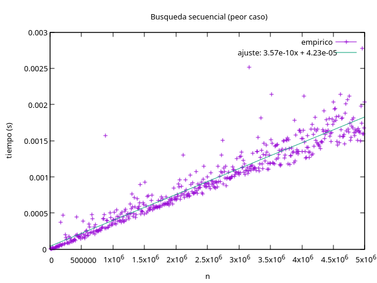
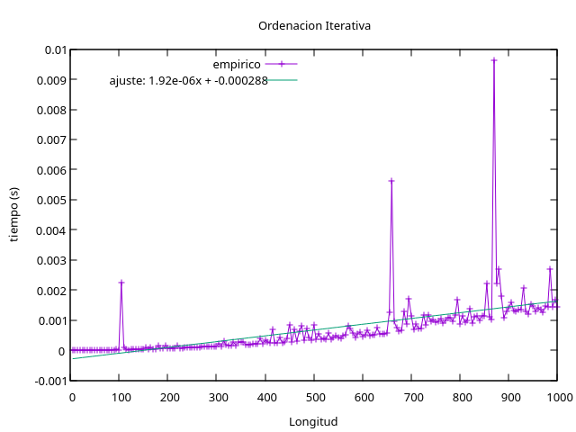
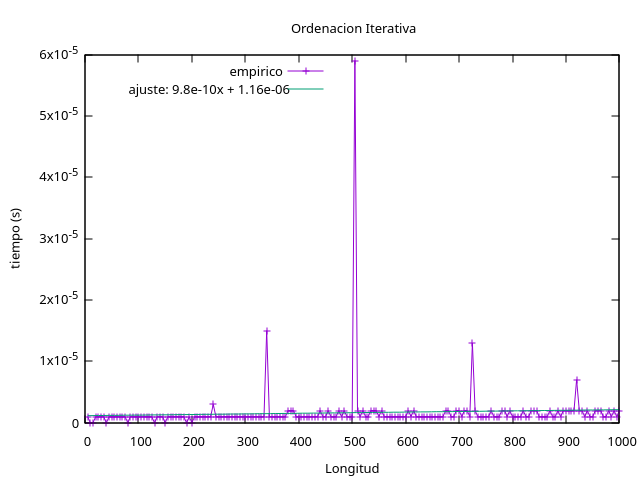
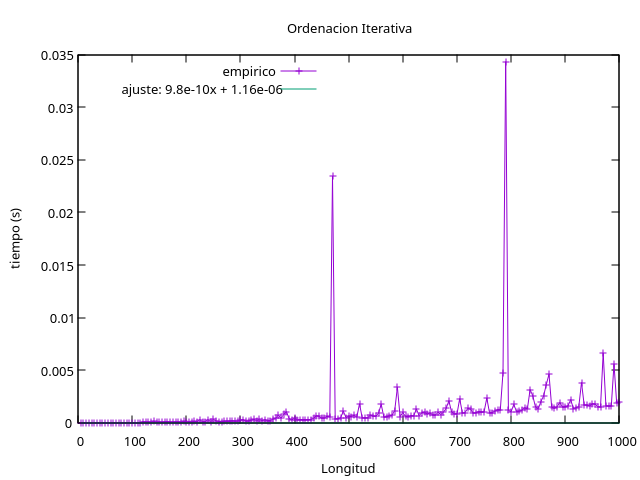
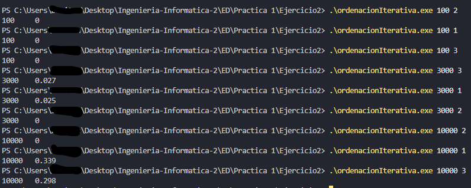
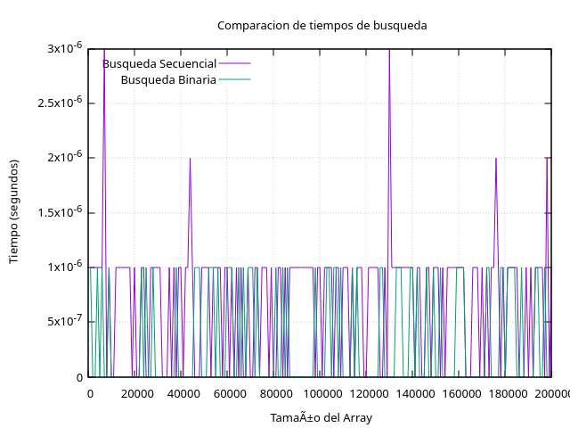
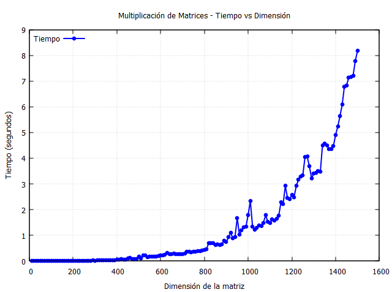

# Práctica 1 ED | 2º Ingeniería Informática David Rodriguez Aparicio

En este documento encontraremos los distintos códigos de los ejercicios, algunas explicaciones sobre estos y algunos archivos extras como imagenes sobre estos.

Los códigos están hechos a mano, con alguna ayuda o corrección mediante IA, pero con comprensión completa sobre ellos, al fin y al cabo son algoritmos simples que suelen tener una solución fija ( no suele cambiar el funcionamiento entre las distintas soluciones posibles ).

Veremos distintos códigos principalmente en C++, bash para alguna ejecucion y creacion de archivos de datos, Makefile para la compilación de los ejercicios y los códigos usados para sacar las respectivas imágenes mediante Gnuplot.

No hay uso excesivo de comentarios, al ser códigos no tan extensos se pueden entender bien lo que hace cada uno, y los que hay son partes de código de comprobación y pruebas.


## EJERCICIO 1

Este código es una busqueda simple dato a dato del array, no tiene mucho misterio.

También tenemos el código bash, que no pondremos el resto, ya que son casi idénticos, al igual que el Makefile, y la gráfica.

```c++

#include <iostream>
#include <ctime>
#include <cstdlib>
using namespace std;

int main(int argc, char* argv[]) {

    

    int longitud = ( argc < 2 ) ? 5 : atoi(argv[1]) ;
    
    srand(time(nullptr)); 
    int* arrayBuscar = new int[longitud];

 /*    for (int n = 0; n < longitud; n++){
        cout << arrayBuscar[n] << endl;
    } */

    for (int i = 0; i < longitud; ++i) {
        arrayBuscar[i] = rand() % 10000;
    }

    int numBuscar = 10000;
    
 /*    for (int n = 0; n < longitud; n++){
        cout << arrayBuscar[n] << endl;
    } */

    // Temporizador

    clock_t start = clock();
    
    for (int i = 0; i < longitud; ++i) {
        
        if (arrayBuscar[i] == numBuscar) {
            return i;
        }
    }

    clock_t end = clock();

    double tiempo = (end - start) / (double)CLOCKS_PER_SEC;

    // cout << endl << "Tiempo empleado: "<< tiempo << endl ;
    
    cout << endl << longitud <<" "<< tiempo << endl ;

    return 0;
}

```


```bash

#!/bin/bash

set -e
echo -n > tiempos_busqueda.dat

for n in $(seq 10000 10000 5000000); do
  ./busquedaSecuencial "$n" >> tiempos_busqueda.dat
done

echo "Listo -> tiempos_busqueda.dat"

```


```makefile

CXX = g++
CXXFLAGS = -Wall -O2

all: busquedaSecuencial

busqueda_secuencial: busquedaSecuencial.cpp
	$(CXX) $(CXXFLAGS) $< -o $@

clean:
	rm -f busquedaSecuencial.exe tiempos_busqueda.dat

```




## EJERCICIO 2

En este ejercicio usamos el algoritmo de busqueda Burbuja Optimizado (que va comparando las posiciones adyacentes del array) , y probamos las distintas formas mediante un switch en el código.

Al ejercicio se le pasan 2 datos, el primero la longitud del array, y el segundo la forma de actuar, tienen valores por defecto para evitar algunos errores, aunque no está exento de ellos, se han pensado en algunos errores básicos pero no en todas las posibilidades.

Tenemos varias imagenes de las distintas gráficas.


```c++

#include <iostream>
#include <ctime>
#include <cstdlib>
using namespace std;

void burbujaOptimizado(int *array, int longitud){
    
    int aux;
    bool ordenado = false;
    int interacciones;
    
    while(!ordenado){
    
        interacciones = 0;

        for( int n=0; n<longitud-1;n++ ){
        
            
            
            if(array[n]>array[n+1]){
                aux = array[n+1];
                array[n+1] = array[n];
                array[n] = aux;
                
                if(array[n+1] != 0 ){
                    interacciones++;
                }
                
            }

            // cout << "Interaccion "<< n << endl;
        }

        if(interacciones == 0 ) ordenado = true;
        
    }

  /*   for( int n=0; n<longitud;n++ ){
        
        cout << array[n] << " ";

    }
    cout << endl << endl; */
}


int main(int argc,char* argv[]) {

    int longitud = ( argc < 2 ) ? 5 : atoi(argv[1]);
    int arrayOrdenar[longitud]; 
    int opcion = ( argc < 3 || atoi(argv[2])<1 || atoi(argv[2])>3) ? 1 : atoi(argv[2]);

    switch (opcion){
        case 1:
            
            for (int i = 0; i < longitud; ++i) {
                arrayOrdenar[i] = rand() % 1000;
            }
            break;
        case 2:
            
            for (int i = 0; i < longitud; ++i) {
                arrayOrdenar[i] = i+1;
            }
            break;

        case 3:
            for (int i = 0; i < longitud; ++i) {
                arrayOrdenar[i] = longitud-i;
            }
            break;

    }

    
    clock_t start = clock();
    burbujaOptimizado(arrayOrdenar,longitud);
    clock_t end = clock();

    double tiempo = (end - start) / (double)CLOCKS_PER_SEC;
    
    cout << longitud << "\t" << tiempo << endl;

    
}

```








## EJERCICIO 3

En este ejercicio hacemos una prueba y comparamos la busqueda secuencial y la binaria (tiene que estar ordenado el array).

Esta segunda se basa en ir partiendo a la mitad el array y viendo en cual de las particiones puede estar, se toman ambos tiempos y se muestran en la gráfica.

Hay algunas pruebas con otras librerias como ya te comenté. La mayoría de codigos están probados tanto en Linux-Ubuntu24 como en Windows10-11.

```c++

#include <iostream>
#include <ctime>
#include <cstdlib>
#include <chrono>
using namespace std;

int busquedaSecuencial (int *array, int longitud, int valorBuscado){
    
    for(int i = 0; i < longitud; i++) {
       
        if(array[i] == valorBuscado){
            
            // cout << "Elemento Encontrado :" << valorBuscado << "(pos " << i << ")"<<endl;
            return i;
        } 
    }

    return -1;
    
}

int BusquedaBinaria(int *array, int longitud, int valorBuscado){
    int inicio = 0;
    int fin = longitud-1;
   

    /* SOLO SIRVE PARA ARRAYS ORDENADOS. */
    
    while(inicio <= fin) {
        
        int medio = (inicio + fin) / 2;
        
        if(array[medio] == valorBuscado){
            
            // cout << "Elemento Encontrado :" << valorBuscado << "(pos " << medio << ")"<<endl;
            return medio;

        }else if(array[medio] < valorBuscado){

            inicio = medio + 1;

        }else{
            fin = medio - 1;
        }
    }

    

    return -1; // No encontrado
}


/* Se le va a pasar la longitud del array */
int main(int argc,char* argv[]) {

    int longitud = ( argc < 2 ) ? 5 : atoi(argv[1]);
    int arrayBuscar[longitud];
    
     

    for (int i = 0; i < longitud; ++i) {
        arrayBuscar[i] = i;
    }
   
    /* Elegir elemento a buscar */
    srand(time(nullptr)); 
    int posicion = rand() % longitud;
    int elementoBuscar = arrayBuscar[posicion];

    // cout << endl << "Elemento a buscar: " << elementoBuscar <<endl;
    cout << longitud;
    
    
    
    /* Doble Proceso de Busqueda y sus tiempos */
    clock_t start = clock();
    busquedaSecuencial(arrayBuscar,longitud,elementoBuscar);
    clock_t end = clock();
    double tiempo = (end - start) / (double)CLOCKS_PER_SEC;

    cout <<" "<< tiempo;

    start = clock();
    // auto start2 = std::chrono::high_resolution_clock::now();

    BusquedaBinaria(arrayBuscar,longitud,elementoBuscar);
    
    end = clock();
    // auto end2 = std::chrono::high_resolution_clock::now();

    // std::chrono::duration<double> duration = end2 - start2;
    tiempo = (end - start) / (double)CLOCKS_PER_SEC;

    cout <<" "<< tiempo << endl ;
    // cout <<" "<< duration.count() << endl ;

}

```



## EJERCICIO 4


```c++

#include <iostream>
#include <ctime>
#include <cstdlib>
// #include <chrono>

using namespace std;


int** generarMatriz(int dimensiones){

    int** matriz = new int*[dimensiones];

    // cout << endl;

    for (int filas=0; filas<dimensiones; filas++){

        matriz[filas] = new int[dimensiones];

        for(int col=0; col<dimensiones; col++){
            
            matriz[filas][col] = rand() % 10;
            
            // cout << matriz[filas][col] << " ";
        }
        // cout << endl;
        
    }
    
    // cout << "Matriz creada" << endl;
    return matriz;
}


/* Se podría hacer el proceso para crear matrices válidas, pero vamos a hacerlo para matrices Cuadradas (que las dimensiones resultantes son las mismas) */
void multiplicarMatricesCuadradas(int** matriz1,int** matriz2,int dimensiones){


    int** nuevaMatriz = new int*[dimensiones];

    for (int i = 0; i < dimensiones; i++) {
        nuevaMatriz[i] = new int[dimensiones];
    }

    
    for (int i = 0; i < dimensiones; i++) {
        for (int j = 0; j < dimensiones; j++) {
            int suma = 0;
            for (int k = 0; k < dimensiones; k++) {
                suma += matriz1[i][k] * matriz2[k][j];
            }
            nuevaMatriz[i][j] = suma;
        }
    }

    /* Visualizar Nueva Matriz - Comentar Despues -> Comprobacion de Multiplicacion Hecha, Correcta */
/*     cout << endl;
    for (int filas=0; filas<dimensiones; filas++){
        for(int col=0; col<dimensiones; col++){
            
            cout << nuevaMatriz[filas][col] << " ";
        }
        cout << endl;
        
    }  */

    // return nuevaMatriz;
}


int main(int argc,char* argv[]) {

    int dimensionMat = ( argc < 2 ) ? 3 : atoi(argv[1]);

    srand(time(nullptr)); 

    int** matriz1 = generarMatriz(dimensionMat);
    int** matriz2 = generarMatriz(dimensionMat);
    
    

    clock_t start = clock();
    multiplicarMatricesCuadradas(matriz1, matriz2, dimensionMat);
    clock_t end = clock();

    double tiempo = (end - start) / (double)CLOCKS_PER_SEC;

    cout << dimensionMat;
    cout <<" "<< tiempo << endl;

}

```


