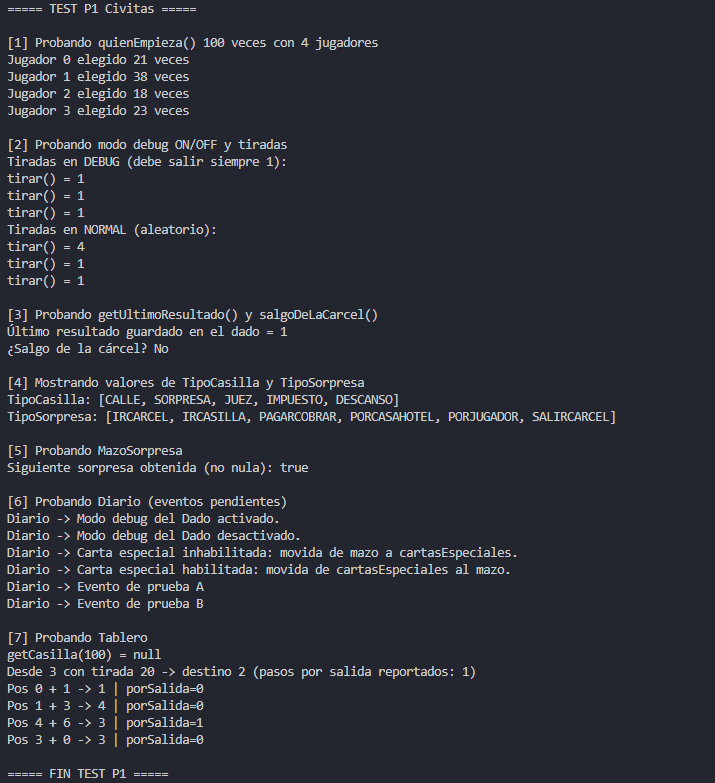

# Práctica 1 PDO | 2º Ingeniería Informática David Rodriguez Aparicio

En este documento vamos a explicar los distintos archivos añadidos en la práctica.

Con este documento el profesor puede revisar todo el código creado, además estará en pdf,html y png en la carpeta info.

Aunque el zip contará con todos los archivos de código para revisar de forma más precisa.

## Casilla.java

Este archivo es temporal, simplemente es la clase Casilla momentanea para que funcione lo creado hasta ahora.

```java

package civitas;

public class Casilla {
    
    private String nombre;


    /* Constructor */
    Casilla(String nombre) {
        this.nombre = nombre;
    }

    


    /* GETTERS / SETTERS */
    String getNombre() {
        return nombre;
    }

}


```

## Dado.java

En esta clase se define el dado, una clase singletone con las propias funciones del dado como tirar, comprobar la carcel o activar el modo debugger entre otras.

```java

package civitas;
import java.util.ArrayList;
import java.util.Random;


@SuppressWarnings("all")
class Dado{
    
    private Random random;
    private int ultimoResultado;
    private boolean debug;

    private static Dado instance = new Dado(); /* Declara Su propia instancia (Singletone) */
    private static final int salidaCarcel = 5;


    /* ---------------------- Constructor ---------------------- */
    Dado (){

        random = new Random();
        ultimoResultado = 0;
        this.debug = false;
    }


    /*  ---------------------- Métodos ---------------------- */

    int tirar(){
        
        this.ultimoResultado = ( debug ) ? 1 : random.nextInt(6) + 1;

        return this.ultimoResultado;

    }

    boolean salgoDeLaCarcel() {
        int resultado = tirar();

        return ( resultado == salidaCarcel );
    }

    int quienEmpieza(int n) {
        return random.nextInt(n); /* Se usa n ya que si hay 5 jugadores ( 5-1 = 4), va del 0-4.99999 */
    }

    
    
    void setDebug(boolean d) {
        debug = d; /* d será true/false */

        String mensaje;

        mensaje = (debug) ? "Modo debug del Dado activado." : "Modo debug del Dado desactivado." ; 

        Diario.getInstance().ocurreEvento(mensaje);
    }

    /* ------------------------ Getters ------------------------ */

    static Dado getInstance() {
        return instance;
    }

    int getUltimoResultado() {
        return this.ultimoResultado;
    }
}

```

## mazoSorpresa.java

En este vemos la clase MazoSorpresa, que contiene las distintas cartas que pueden tocar en la casilla de Sorpresa.

Tiene algunas comprobaciones, un doble constructor y para hacer reset de las cartas.

```java

package civitas;
import java.util.ArrayList;
import java.util.Collections;


@SuppressWarnings("all")
class MazoSorpresa{

    private ArrayList<Sorpresa> sorpresas;         
    private boolean barajada;                      
    private int usadas;                            
    private boolean debug;                         
    private ArrayList<Sorpresa> cartasEspeciales;  
    private Sorpresa ultimaSorpresa;               
    


    /* ---------------------- Constructor ---------------------- */ 
    MazoSorpresa(boolean debug) {
        
        this.debug = debug;
        
        init();
        
        if (debug) {
            Diario.getInstance().ocurreEvento("Modo DEBUG de Mazo Sopresa.");
        }
    }

    MazoSorpresa() {
        this(false);

        init();
    }

    /*  ---------------------- Métodos ---------------------- */

    /* Digamos que es el constructor pero llamado desde un método privado */
    private void init() {
        sorpresas = new ArrayList<>();
        cartasEspeciales = new ArrayList<>();
        barajada = false;
        usadas = 0;
        ultimaSorpresa = null;
    }


    void alMazo(Sorpresa s) {
        if (!barajada) {
            sorpresas.add(s);
        }
    }

    
    Sorpresa siguiente() {
        if (sorpresas.isEmpty()) {
            return null;
        }

        // Comprobación para hacer reset
        if (!barajada || usadas == sorpresas.size()) {
            
            if (!debug) {
                Collections.shuffle(sorpresas);
            }

            usadas = 0;
            barajada = true;
        }

        usadas++;

        Sorpresa s = sorpresas.remove(0); 
        sorpresas.add(s);                 
        ultimaSorpresa = s;
        return s;
    }


    
    void inhabilitarCartaEspecial(Sorpresa sorpresa) {
        boolean estabaEnMazo = sorpresas.remove(sorpresa);
        if (estabaEnMazo) {
            cartasEspeciales.add(sorpresa);
            Diario.getInstance().ocurreEvento(
                "Carta especial inhabilitada: movida de mazo a cartasEspeciales."
            );
        }
    }

    void habilitarCartaEspecial(Sorpresa sorpresa) {
        boolean estabaEspecial = cartasEspeciales.remove(sorpresa);
        if (estabaEspecial) {
            sorpresas.add(sorpresa);
            Diario.getInstance().ocurreEvento(
                "Carta especial habilitada: movida de cartasEspeciales al mazo."
            );
        }
    }

    Sorpresa getUltimaSorpresa() {
        return ultimaSorpresa;
    }

    int getUsadas() {
        return usadas;
    }

    boolean isBarajada() {
        return barajada;
    }

    int tamañoMazo() {
        return sorpresas.size();
    }

}

```


## Sorpresa.java

Tambien es una clase temporal.

```java
package civitas;


class Sorpresa{
    
}
```


### Tablero.java

Incluye todas las funciones de un tablero, avance de casillas, carcel, juez, carcel, etc.

```java

package civitas;
import java.util.ArrayList;

@SuppressWarnings("all")
class Tablero{

    private int numCasillaCarcel;
    private ArrayList<Casilla> casillas; 
    private int porSalida;
    private boolean tieneJuez;
     
    /* ---------------------- Constructor ---------------------- */
    Tablero (int numCasillaCarcel ){
        
        this.numCasillaCarcel = ( numCasillaCarcel >= 1 ) ? numCasillaCarcel : 1 ;
        this.casillas = new ArrayList<>();
        this.casillas.add(new Casilla("Salida"));
        this.porSalida = 0;
        this.tieneJuez = false;

    }

    /*  ---------------------- Métodos ---------------------- */

    private Boolean tableroCorrecto(){
        return ( (casillas.size() > numCasillaCarcel) && tieneJuez ) ; 
    }

    Boolean tableroCorrecto(int numCasilla){
        return tableroCorrecto() && numCasilla >= 0 && numCasilla < casillas.size();
    }

    void añadeCasilla (Casilla casilla){
        
        if( casillas.size() == this.numCasillaCarcel ){
            casillas.add( new Casilla("Cárcel") );
        }

        casillas.add( casilla );
        
        if (casillas.size() == numCasillaCarcel) {
            casillas.add(new Casilla("Cárcel")); 
        }

    }

    void añadeJuez() {
        
        if (!this.tieneJuez) {
            casillas.add(new Casilla("Juez"));
            this.tieneJuez = true;
        }
    }

    int nuevaPosicion(int actual, int tirada){
        
        if( !this.tableroCorrecto() ){
            return -1;
        }else{
            
            int tamaño = casillas.size();
            int suma = actual + tirada;
            int nuevaPosicion = suma % tamaño;

            if(suma != nuevaPosicion){
                this.porSalida++;
            }
            return nuevaPosicion;
        }
    }

    int calcularTirada( int origen, int destino){
        int numeroDado;

        if(destino < origen ){
            numeroDado = this.casillas.size() - origen + destino;
        }else{
            numeroDado = destino - origen;
        }

        return numeroDado;
    }

    /* ------------------------ Getters ------------------------ */
    int getCarcel(){
        return this.numCasillaCarcel;
    }

    int getPorSalida(){
        if( this.porSalida > 0){
            this.porSalida--;
            return this.porSalida+1;
        }else{
            return this.porSalida;
        }
    }

    Casilla getCasilla(int numCasilla){
        return ( tableroCorrecto(numCasilla) ) ?  casillas.get(numCasilla) : null; 
    }
}


```

## TestP1.java

En este archivo se encuentran todas las pruebas sobre las distintas clases y métodos creados anteriormente.

Se usan algunas técnicas como cadenas de formato y argumentos en cadenas de texto, uso de arrays con sus correspondientes foreach, y el uso de las clases y sus métodos.

Recalcar que en las clases también se han hecho uso de operadores ternarios, ya que me parecen más cómodos y queda el código más limpio.


```java

package civitas;

import java.util.Arrays;


class TestP1 {

    public static void main() {
        System.out.println("===== TEST P1 Civitas =====");

        // ------------------------------------------------------------
        // 1) quienEmpieza() 100 veces con 4 jugadores y conteo
        
        System.out.println("\n[1] Probando quienEmpieza() 100 veces con 4 jugadores");
        Dado dado = Dado.getInstance();
        int jugadores = 4;
        int[] frecuencias = new int[jugadores];

        Arrays.fill(frecuencias, 0);

        for (int i = 0; i < 100; i++) {
            int idx = dado.quienEmpieza(jugadores);
            frecuencias[idx]++;
        }
        for (int i = 0; i < jugadores; i++) {
            System.out.printf("Jugador %d elegido %d veces\n", i, frecuencias[i]);
        }

        // ------------------------------------------------------------
        // 2) Modo debug on/off y tiradas

        System.out.println("\n[2] Probando modo debug ON/OFF y tiradas");
        dado.setDebug(true);
        System.out.println("Tiradas en DEBUG (debe salir siempre 1):");
        for (int i = 0; i < 3; i++) {
            System.out.println("tirar() = " + dado.tirar());
        }

        dado.setDebug(false);
        System.out.println("Tiradas en NORMAL (aleatorio):");
        for (int i = 0; i < 3; i++) {
            System.out.println("tirar() = " + dado.tirar());
        }

        // ------------------------------------------------------------
        // 3) getUltimoResultado() y salgoDeLaCarcel()
        
        System.out.println("\n[3] Probando getUltimoResultado() y salgoDeLaCarcel()");
        int ultimo = dado.getUltimoResultado();
        System.out.println("Último resultado guardado en el dado = " + ultimo);
        boolean sale = dado.salgoDeLaCarcel();
        System.out.println("¿Salgo de la cárcel? " + (sale ? "Sí" : "No"));

        // ------------------------------------------------------------
        // 4) Mostrar valores de los enumerados
        
        System.out.println("\n[4] Mostrando valores de TipoCasilla y TipoSorpresa");
        System.out.println("TipoCasilla: " + Arrays.toString(TipoCasilla.values()));
        System.out.println("TipoSorpresa: " + Arrays.toString(TipoSorpresa.values()));

        // ------------------------------------------------------------
        // 5) MazoSorpresas: añadir 2 sorpresas, siguiente, inhabilitar/habilitar

        System.out.println("\n[5] Probando MazoSorpresa");
        MazoSorpresa mazo = new MazoSorpresa(false); // normal
        Sorpresa s1 = new Sorpresa();
        Sorpresa s2 = new Sorpresa();
        mazo.alMazo(s1);
        mazo.alMazo(s2);

        Sorpresa activa = mazo.siguiente();
        System.out.println("Siguiente sorpresa obtenida (no nula): " + (activa != null));

        // Inhabilitar la segunda carta añadida
        mazo.inhabilitarCartaEspecial(s2);
        // Habilitar de nuevo la segunda carta
        mazo.habilitarCartaEspecial(s2);

        // ------------------------------------------------------------
        // 6) Diario: probar sus métodos (leer eventos pendientes)
        System.out.println("\n[6] Probando Diario (eventos pendientes)");
        Diario diario = Diario.getInstance();
        // Forzamos algunos eventos
        diario.ocurreEvento("Evento de prueba A");
        diario.ocurreEvento("Evento de prueba B");
        while (diario.eventosPendientes()) {
            System.out.println("Diario -> " + diario.leerEvento());
        }

        // ------------------------------------------------------------
        // 7) Tablero: casillas, errores controlados, tiradas y nuevaPosicion()
        System.out.println("\n[7] Probando Tablero");
        Tablero Tablero = new Tablero(5);
        Tablero.añadeCasilla(new Casilla("Calle 1"));
        Tablero.añadeCasilla(new Casilla("Calle 2"));
        Tablero.añadeCasilla(new Casilla("Impuesto"));
        Tablero.añadeCasilla(new Casilla("Sorpresa"));
        Tablero.añadeJuez(); 

        
        int idxInvalido = 999;
        System.out.println("getCasilla(" + idxInvalido + ") = " + Tablero.getCasilla(idxInvalido));

        
        int posicionActual = 3;
        int tirada = 20;
        int destino = Tablero.nuevaPosicion(posicionActual, tirada);
        int vecesSalida = Tablero.getPorSalida(); 
        System.out.printf("Desde %d con tirada %d -> destino %d (pasos por salida reportados: %d)\n",
                posicionActual, tirada, destino, vecesSalida);

        
        int[] tiradas = {1, 3, 6, 0};
        int pos = 0;
        for (int t : tiradas) {
            int dest = Tablero.nuevaPosicion(pos, t);
            int ps = Tablero.getPorSalida();
            System.out.printf("Pos %d + %d -> %d | porSalida=%d\n", pos, t, dest, ps);
            pos = dest;
        }

        System.out.println("\n===== FIN TEST P1 =====");
    }
}


```


## Prueba TestP1

