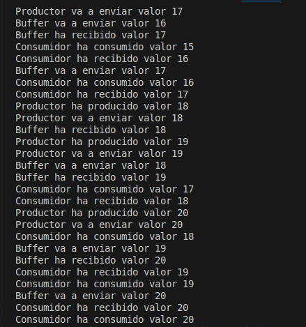
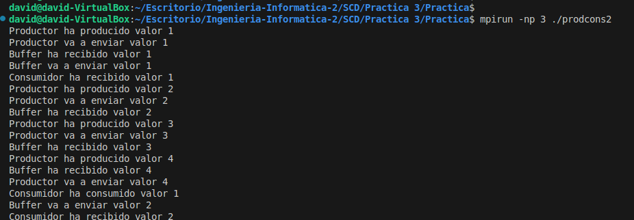
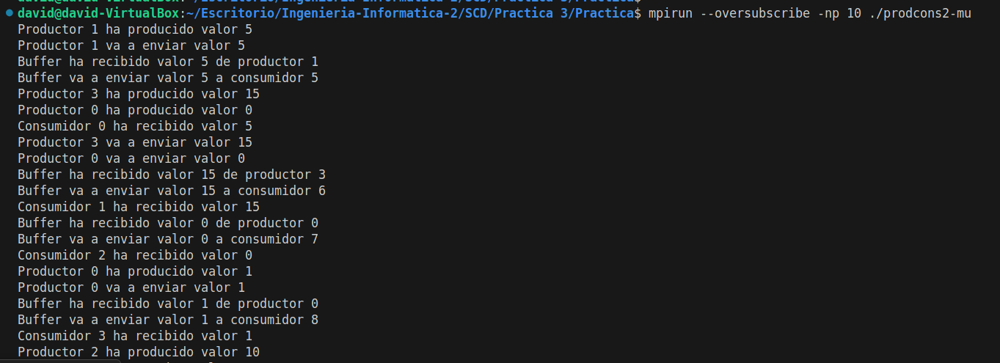
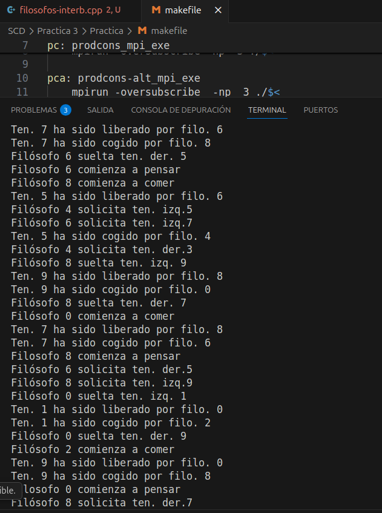
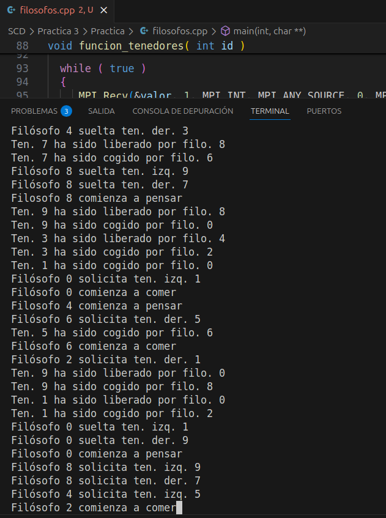

# Practica 3 SCD | David Rodríguez Aparicio

En esta práctica hemos usado MPI en Ubuntu.

Veremos los distintos códigos y sus cambios acompañados de una explicación y una imagen de su ejecución

## Apartado 1 | Prueba de prodcons.cpp

En este apartado lo único que hemos hecho es probar el código y ya.



## Apartado 2 | prodcons2-mu.cpp

Aqui ya si hemos tocado código, hemos modificado el código para que se hayan múltiples productores y consumidores.

Hemos añadido algunas variables necesarias, cambiado las funciones productora/consumidora y cada consumidor recibe un numero proporcional de items, añadiendole a las funciones además parametros.

Y hemos adaptado el buffer para que acepte cualquier consumidor o productor con MPI_ANY_SOURCE y MPI_ANY_TAG

A continuacion veremos la diferencia entre el original y el nuevo.




```c++

// -----------------------------------------------------------------------------
//
// Sistemas concurrentes y Distribuidos.
// Práctica 3. Implementación de algoritmos distribuidos con MPI
//
// Archivo: prodcons2.cpp
// Implementación del problema del productor-consumidor con
// un proceso intermedio que gestiona un buffer finito y recibe peticiones
// en orden arbitrario
// (versión con un único productor y un único consumidor)
//
// Historial:
// Actualizado a C++11 en Septiembre de 2017
// -----------------------------------------------------------------------------

#include <iostream>
#include <thread> // this_thread::sleep_for
#include <random> // dispositivos, generadores y distribuciones aleatorias
#include <chrono> // duraciones (duration), unidades de tiempo
#include <mpi.h>

using namespace std;
using namespace std::this_thread ;
using namespace std::chrono ;

const int
   num_items  = 20,     // nº total de ítems producidos/consumidos
   tam_vector = 10,     // tamaño del buffer

   np         = 4,      // nº de productores
   nc         = 5,      // nº de consumidores

   id_buffer  = np,                 // id del proceso buffer
   num_procesos_esperado = np+nc+1, // total de procesos

   etiq_prod  = 0,      // etiqueta mensajes de productores
   etiq_cons  = 1;      // etiqueta mensajes de consumidores

//**********************************************************************
// plantilla de función para generar un entero aleatorio uniformemente
// distribuido entre dos valores enteros, ambos incluidos
// (ambos tienen que ser dos constantes, conocidas en tiempo de compilación)
//----------------------------------------------------------------------

template< int min, int max > int aleatorio()
{
  static default_random_engine generador( (random_device())() );
  static uniform_int_distribution<int> distribucion_uniforme( min, max ) ;
  return distribucion_uniforme( generador );
}
// ---------------------------------------------------------------------
// ptoducir produce los numeros en secuencia (1,2,3,....)
// y lleva espera aleatorio
int producir( int orden_prod )
{
   static int contadores[np] = {0};   // un contador por productor
   const int k = num_items / np;

   sleep_for( milliseconds( aleatorio<10,100>() ) );

   int valor = orden_prod * k + contadores[orden_prod];
   contadores[orden_prod]++;

   cout << "Productor " << orden_prod
        << " ha producido valor " << valor << endl << flush;

   return valor;
}
// ---------------------------------------------------------------------

void funcion_productor( int orden_prod )
{
   const int num_items_prod = num_items / np;

   for ( int i = 0 ; i < num_items_prod ; i++ )
   {
      int valor_prod = producir( orden_prod );
      cout << "Productor " << orden_prod
           << " va a enviar valor " << valor_prod << endl << flush;

      MPI_Ssend( &valor_prod, 1, MPI_INT,
                 id_buffer, etiq_prod, MPI_COMM_WORLD );
   }
}
// ---------------------------------------------------------------------

void consumir(int valor_cons)
{
   sleep_for(milliseconds( aleatorio<110,200>() ));
   cout << "Consumidor ha consumido valor " << valor_cons << endl << flush;
}
// ---------------------------------------------------------------------

void funcion_consumidor( int orden_cons )
{
   int peticion = 1 ;
   int valor_rec ;
   MPI_Status estado ;
   const int num_items_cons = num_items / nc;

   for( int i = 0 ; i < num_items_cons ; i++ )
   {
      // enviar petición al buffer
      MPI_Ssend( &peticion, 1, MPI_INT,
                 id_buffer, etiq_cons, MPI_COMM_WORLD );

      // recibir dato del buffer
      MPI_Recv( &valor_rec, 1, MPI_INT,
                id_buffer, etiq_cons, MPI_COMM_WORLD, &estado );

      cout << "Consumidor " << orden_cons
           << " ha recibido valor " << valor_rec << endl << flush ;

      consumir( valor_rec );
   }
}
// ---------------------------------------------------------------------

void funcion_buffer()
{
   int  buffer[tam_vector];      // celdas del buffer
   int  valor;
   int  primera_libre       = 0;
   int  primera_ocupada     = 0;
   int  num_celdas_ocupadas = 0;
   MPI_Status estado;

   // en total llegarán num_items mensajes de productores
   // y num_items mensajes de consumidores (peticiones)
   for (int i = 0; i < num_items*2; i++)
   {
      int tag_aceptable;

      // determinar qué tipo de emisor es aceptable según estado del buffer
      if ( num_celdas_ocupadas == 0 )              // buffer vacío
         tag_aceptable = etiq_prod;                // sólo productores
      else if ( num_celdas_ocupadas == tam_vector) // buffer lleno
         tag_aceptable = etiq_cons;                // sólo consumidores
      else
         tag_aceptable = MPI_ANY_TAG;              // cualquiera

      // recibir mensaje de algún productor o consumidor
      MPI_Recv(&valor, 1, MPI_INT,
               MPI_ANY_SOURCE, tag_aceptable,
               MPI_COMM_WORLD, &estado);

      switch (estado.MPI_TAG)
      {
         // mensaje de productor: insertar en buffer
         case etiq_prod:
            buffer[primera_libre] = valor;
            primera_libre = (primera_libre + 1) % tam_vector;
            num_celdas_ocupadas++;
            cout << "Buffer ha recibido valor " << valor
                 << " de productor " << estado.MPI_SOURCE << endl;
            break;

         // mensaje de consumidor: extraer de buffer y enviarle
         case etiq_cons:
            valor = buffer[primera_ocupada];
            primera_ocupada = (primera_ocupada + 1) % tam_vector;
            num_celdas_ocupadas--;
            cout << "Buffer va a enviar valor " << valor
                 << " a consumidor " << estado.MPI_SOURCE << endl;

            MPI_Ssend(&valor, 1, MPI_INT,
                      estado.MPI_SOURCE, etiq_cons, MPI_COMM_WORLD);
            break;
      }
   }
}


// ---------------------------------------------------------------------

int main( int argc, char *argv[] )
{

   int id_propio, num_procesos_actual;

   MPI_Init(&argc, &argv);
   MPI_Comm_rank(MPI_COMM_WORLD, &id_propio);
   MPI_Comm_size(MPI_COMM_WORLD, &num_procesos_actual);


    if (num_procesos_actual == num_procesos_esperado){
      if (id_propio < np)                         // productores
      {
         int orden_prod = id_propio;              // 0..np-1
         funcion_productor(orden_prod);
      }
      else if (id_propio == id_buffer)            // buffer
      {
         funcion_buffer();
      }
      else                                        // consumidores
      {
         int orden_cons = id_propio - (np + 1);   // 0..nc-1
         funcion_consumidor(orden_cons);
      }
   }else if (id_propio == 0){
      cerr << "Número de procesos actual (" << num_procesos_actual
           << ") distinto de " << num_procesos_esperado << endl;
   }

   MPI_Finalize();
   return 0;
}


```


## Apartado 3 | Filosofos

Aqui lo dividiremos en 3 partes 

### Filosofos-Interb.cpp

En este apartado hemos ido completando el código original con operaciones con MPI, usando MPI_Ssend y MPI_Recv para aceptar las peticiones y esperar el Send.

Como todos los filósofos piden primero el tenedor izquierdo y luego el derecho, el sistema puede quedarse bloqueado si todos los filósofos toman su tenedor izquierdo al mismo tiempo → esto provoca interbloqueo.




```c++

// -----------------------------------------------------------------------------
//
// Sistemas concurrentes y Distribuidos.
// Práctica 3. Implementación de algoritmos distribuidos con MPI
//
// Archivo: filosofos-plantilla.cpp
// Implementación del problema de los filósofos (sin camarero).
// Plantilla para completar.
//
// Historial:
// Actualizado a C++11 en Septiembre de 2017
// -----------------------------------------------------------------------------


#include <mpi.h>
#include <thread> // this_thread::sleep_for
#include <random> // dispositivos, generadores y distribuciones aleatorias
#include <chrono> // duraciones (duration), unidades de tiempo
#include <iostream>

using namespace std;
using namespace std::this_thread ;
using namespace std::chrono ;

const int
   num_filosofos = 5 ,              // número de filósofos 
   num_filo_ten  = 2*num_filosofos, // número de filósofos y tenedores 
   num_procesos  = num_filo_ten ;   // número de procesos total (por ahora solo hay filo y ten)


//**********************************************************************
// plantilla de función para generar un entero aleatorio uniformemente
// distribuido entre dos valores enteros, ambos incluidos
// (ambos tienen que ser dos constantes, conocidas en tiempo de compilación)
//----------------------------------------------------------------------

template< int min, int max > int aleatorio()
{
  static default_random_engine generador( (random_device())() );
  static uniform_int_distribution<int> distribucion_uniforme( min, max ) ;
  return distribucion_uniforme( generador );
}

// ---------------------------------------------------------------------

void funcion_filosofos( int id )
{
  int id_ten_izq = (id+1) % num_filo_ten, //id. tenedor izq.
      id_ten_der = (id+num_filo_ten-1) % num_filo_ten; //id. tenedor der.

   
   int mensaje = 0; 

  while ( true )
  {
    cout <<"Filósofo " <<id << " solicita ten. izq." <<id_ten_izq <<endl;
      MPI_Ssend(&mensaje, 1, MPI_INT, id_ten_izq, 0, MPI_COMM_WORLD);

    cout <<"Filósofo " <<id <<" solicita ten. der." <<id_ten_der <<endl;
      MPI_Ssend(&mensaje, 1, MPI_INT, id_ten_der, 0, MPI_COMM_WORLD);

    cout <<"Filósofo " <<id <<" comienza a comer" <<endl ;
    sleep_for( milliseconds( aleatorio<10,100>() ) );

    cout <<"Filósofo " <<id <<" suelta ten. izq. " <<id_ten_izq <<endl;
      MPI_Ssend(&mensaje, 1, MPI_INT, id_ten_izq, 0, MPI_COMM_WORLD);

    cout<< "Filósofo " <<id <<" suelta ten. der. " <<id_ten_der <<endl;
      MPI_Ssend(&mensaje, 1, MPI_INT, id_ten_der, 0, MPI_COMM_WORLD);

    cout << "Filosofo " << id << " comienza a pensar" << endl;
    sleep_for( milliseconds( aleatorio<10,100>() ) );
 }
}
// ---------------------------------------------------------------------

void funcion_tenedores( int id )
{
  int valor, id_filosofo ;  // valor recibido, identificador del filósofo
  MPI_Status estado ;       // metadatos de las dos recepciones

  while ( true )
  {
     MPI_Recv(&valor, 1, MPI_INT, MPI_ANY_SOURCE, 0, MPI_COMM_WORLD, &estado);

     id_filosofo = estado.MPI_SOURCE;
     cout <<"Ten. " <<id <<" ha sido cogido por filo. " <<id_filosofo <<endl;

     MPI_Recv(&valor, 1, MPI_INT, id_filosofo, 0, MPI_COMM_WORLD, &estado);
     cout <<"Ten. "<< id<< " ha sido liberado por filo. " <<id_filosofo <<endl ;
  }
}
// ---------------------------------------------------------------------

int main( int argc, char** argv )
{
   int id_propio, num_procesos_actual ;

   MPI_Init( &argc, &argv );
   MPI_Comm_rank( MPI_COMM_WORLD, &id_propio );
   MPI_Comm_size( MPI_COMM_WORLD, &num_procesos_actual );


   if ( num_procesos == num_procesos_actual )
   {
      // ejecutar la función correspondiente a 'id_propio'
      if ( id_propio % 2 == 0 )          // si es par
         funcion_filosofos( id_propio ); //   es un filósofo
      else                               // si es impar
         funcion_tenedores( id_propio ); //   es un tenedor
   }
   else
   {
      if ( id_propio == 0 ) // solo el primero escribe error, indep. del rol
      { cout << "el número de procesos esperados es:    " << num_procesos << endl
             << "el número de procesos en ejecución es: " << num_procesos_actual << endl
             << "(programa abortado)" << endl ;
      }
   }

   MPI_Finalize( );
   return 0;
}

// ---------------------------------------------------------------------


```


### Filosofos.cpp

Aqui el único cambio realizado es en función_filosofos(), en el que el filosofo 0 invierte el orden de peticion entre derecha e izquierda, rompiendo así la espera circular.



```c++


void funcion_filosofos( int id )
{
  int id_ten_izq = (id+1)              % num_filo_ten, //id. tenedor izq.
      id_ten_der = (id+num_filo_ten-1) % num_filo_ten; //id. tenedor der.

   
   int mensaje = 0; 

  while ( true )
  {

    if(id == 0){
      cout <<"Filósofo " <<id <<" solicita ten. der. " <<id_ten_der <<endl;
      MPI_Ssend(&mensaje, 1, MPI_INT, id_ten_der, 0, MPI_COMM_WORLD);

      cout <<"Filósofo " <<id << " solicita ten. izq. " <<id_ten_izq <<endl;
      MPI_Ssend(&mensaje, 1, MPI_INT, id_ten_izq, 0, MPI_COMM_WORLD);
    }else{
      cout <<"Filósofo " <<id << " solicita ten. izq. " <<id_ten_izq <<endl;
      MPI_Ssend(&mensaje, 1, MPI_INT, id_ten_izq, 0, MPI_COMM_WORLD);

      cout <<"Filósofo " <<id <<" solicita ten. der. " <<id_ten_der <<endl;
      MPI_Ssend(&mensaje, 1, MPI_INT, id_ten_der, 0, MPI_COMM_WORLD);
    }

    // ----- comer -----
    cout <<"Filósofo " <<id <<" comienza a comer" <<endl ;
    sleep_for( milliseconds( aleatorio<10,100>() ) );

    // ----- soltar tenedores (mismo orden que antes) -----
    cout <<"Filósofo " <<id <<" suelta ten. izq. " <<id_ten_izq <<endl;
    MPI_Ssend(&mensaje, 1, MPI_INT, id_ten_izq, 0, MPI_COMM_WORLD);

    cout<< "Filósofo " <<id <<" suelta ten. der. " <<id_ten_der <<endl;
    MPI_Ssend(&mensaje, 1, MPI_INT, id_ten_der, 0, MPI_COMM_WORLD);

    cout << "Filosofo " << id << " comienza a pensar" << endl;
    sleep_for( milliseconds( aleatorio<10,100>() ) );
 }
}


```


### Filosofos-cam.cpp

Añadimos el proceso del camarero en este código (id_camarero) y su respectiva funcion, y en cada filosofo se añaden dos envios con Ssend, antes de coger los tenedores y al dejarlos.

Los 5 filosofos nunca estan sentados a la vez.


```c++

// -----------------------------------------------------------------------------
//
// Sistemas concurrentes y Distribuidos.
// Práctica 3. Implementación de algoritmos distribuidos con MPI
//
// Archivo: filosofos-plantilla.cpp
// Implementación del problema de los filósofos (sin camarero).
// Plantilla para completar.
//
// Historial:
// Actualizado a C++11 en Septiembre de 2017
// -----------------------------------------------------------------------------


#include <mpi.h>
#include <thread> // this_thread::sleep_for
#include <random> // dispositivos, generadores y distribuciones aleatorias
#include <chrono> // duraciones (duration), unidades de tiempo
#include <iostream>

using namespace std;
using namespace std::this_thread ;
using namespace std::chrono ;

const int
   num_filosofos = 5,
   num_filo_ten = 2*num_filosofos,  // 10 (filósofos + tenedores)
   id_camarero = num_filo_ten,     // 10
   num_procesos_esperado = num_filo_ten + 1, // 11 procesos en total

   etiq_coger       = 0,
   etiq_soltar      = 1,
   etiq_sentarse    = 2,
   etiq_levantarse  = 3;


//**********************************************************************
// plantilla de función para generar un entero aleatorio uniformemente
// distribuido entre dos valores enteros, ambos incluidos
// (ambos tienen que ser dos constantes, conocidas en tiempo de compilación)
//----------------------------------------------------------------------

template< int min, int max > int aleatorio()
{
  static default_random_engine generador( (random_device())() );
  static uniform_int_distribution<int> distribucion_uniforme( min, max ) ;
  return distribucion_uniforme( generador );
}

// ---------------------------------------------------------------------

void funcion_filosofos( int id )
{
  int id_ten_izq = (id+1) % num_filo_ten, //id. tenedor izq.
      id_ten_der = (id+num_filo_ten-1) % num_filo_ten; //id. tenedor der.

   
   int mensaje = 0; 

  while ( true )
  {
     // 1. SENTARSE
    cout << "Filósofo " << id << " pide SENTARSE" << endl;
    MPI_Ssend(&mensaje, 1, MPI_INT,
              id_camarero, etiq_sentarse, MPI_COMM_WORLD);

    // 2. TENEDORES 
    cout <<"Filósofo " <<id << " solicita ten. izq. " <<id_ten_izq <<endl;
    MPI_Ssend(&mensaje, 1, MPI_INT,
              id_ten_izq, etiq_coger, MPI_COMM_WORLD);

    cout <<"Filósofo " <<id <<" solicita ten. der. " <<id_ten_der <<endl;
    MPI_Ssend(&mensaje, 1, MPI_INT,
              id_ten_der, etiq_coger, MPI_COMM_WORLD);

    // 3. COMER
    cout <<"Filósofo " <<id <<" comienza a comer" <<endl ;
    sleep_for( milliseconds( aleatorio<10,100>() ) );

    // 4. SOLTAR TENEDORES
    cout <<"Filósofo " <<id <<" suelta ten. izq. " <<id_ten_izq <<endl;
    MPI_Ssend(&mensaje, 1, MPI_INT,
              id_ten_izq, etiq_soltar, MPI_COMM_WORLD);

    cout<< "Filósofo " <<id <<" suelta ten. der. " <<id_ten_der <<endl;
    MPI_Ssend(&mensaje, 1, MPI_INT,
              id_ten_der, etiq_soltar, MPI_COMM_WORLD);

    // 5. LEVANTARSE
    cout << "Filósofo " << id << " se LEVANTA" << endl;
    MPI_Ssend(&mensaje, 1, MPI_INT,
              id_camarero, etiq_levantarse, MPI_COMM_WORLD);

    // 6. PENSAR
    cout << "Filosofo " << id << " comienza a pensar" << endl;
    sleep_for( milliseconds( aleatorio<10,100>() ) );
 }
}
// ---------------------------------------------------------------------

void funcion_tenedores( int id )
{
  int valor, id_filosofo ;  // valor recibido, identificador del filósofo
  MPI_Status estado ;       // metadatos de las dos recepciones

  while ( true )
  {
     MPI_Recv(&valor, 1, MPI_INT, MPI_ANY_SOURCE, etiq_coger, MPI_COMM_WORLD, &estado);

     id_filosofo = estado.MPI_SOURCE;
     cout <<"Ten. " <<id <<" ha sido cogido por filo. " <<id_filosofo <<endl;

     MPI_Recv(&valor, 1, MPI_INT, id_filosofo, etiq_soltar, MPI_COMM_WORLD, &estado);

     cout <<"Ten. "<< id<< " ha sido liberado por filo. " <<id_filosofo <<endl ;
  }
}

void funcion_camarero(){
   int sentados = 0;          // número de filósofos sentados
   int valor;
   MPI_Status estado;

   while ( true ){
      int etiq_aceptable;

      // si ya hay 4 sentados, solo aceptamos LEVANTARSE
      if ( sentados == 4 )
         etiq_aceptable = etiq_levantarse;
      else
         etiq_aceptable = MPI_ANY_TAG; 

      // Peticion de filosofo
      MPI_Recv(&valor, 1, MPI_INT,
               MPI_ANY_SOURCE, etiq_aceptable,
               MPI_COMM_WORLD, &estado);

      if ( estado.MPI_TAG == etiq_sentarse ){
         sentados++;
         cout << "Camarero: se sienta el filosofo " << estado.MPI_SOURCE << ". Sentados = " << sentados << endl;

      }else if ( estado.MPI_TAG == etiq_levantarse ){
         sentados--;
         cout << "Camarero: se levanta el filosofo " << estado.MPI_SOURCE << ". Sentados = " << sentados << endl;
      }
   }
}

// ---------------------------------------------------------------------

int main( int argc, char** argv )
{
   int id_propio, num_procesos_actual ;

   MPI_Init( &argc, &argv );
   MPI_Comm_rank( MPI_COMM_WORLD, &id_propio );
   MPI_Comm_size( MPI_COMM_WORLD, &num_procesos_actual );


    if ( num_procesos_esperado == num_procesos_actual ){
      if ( id_propio == id_camarero )
          funcion_camarero();
      else if ( id_propio % 2 == 0 )            // par y < num_filo_ten → filósofo
          funcion_filosofos( id_propio );
      else                                      // impar → tenedor
          funcion_tenedores( id_propio );
    }else{
      if ( id_propio == 0 )
      {
          cout << "el número de procesos esperados es:    " << num_procesos_esperado << endl
            << "el número de procesos en ejecución es: " << num_procesos_actual << endl << "(programa abortado)" << endl ;
      }
    }


   MPI_Finalize( );
   return 0;
}

// ---------------------------------------------------------------------


```
