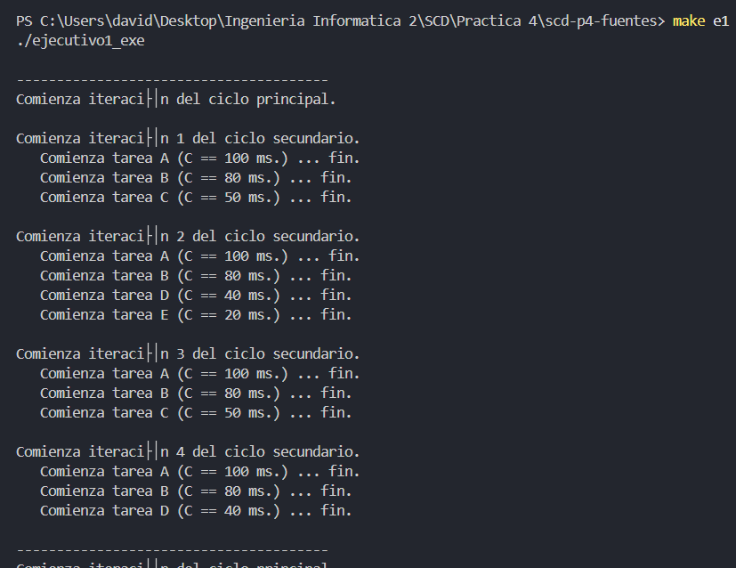
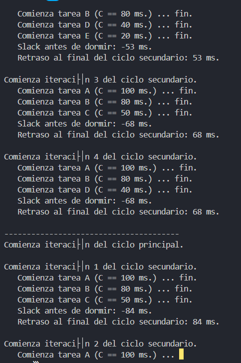
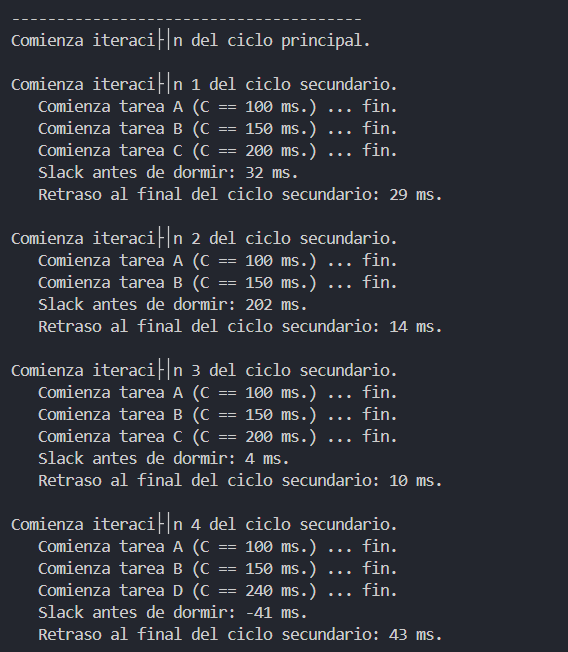

# Practica 3 SCD | David Rodríguez Aparicio

En esta documentación veremos capturas de las ejecuciones de los distintos archivos, además de algunas explicaciones de los códigos y de las herramientas que usaremos.

Usamos programas en bucle para planificación de tareas, para la medicion del tiempo usamos steady_clock() y para las esperas bloqueadas sleep_until() y sleep_for()

## Apartado 1 | Prueba de ejecutivo1.cpp

Este es el ejercicio base para hacer los demás.

```c++

// -----------------------------------------------------------------------------
//
// Sistemas concurrentes y Distribuidos.
// Práctica 4. Implementación de sistemas de tiempo real.
//
// Archivo: ejecutivo1.cpp
// Implementación del primer ejemplo de ejecutivo cíclico:
//
//   Datos de las tareas:
//   ------------
//   Ta.  T    C
//   ------------
//   A  250  100
//   B  250   80
//   C  500   50
//   D  500   40
//   E 1000   20
//  -------------
//
//  Planificación (con Ts == 250 ms)
//  *---------*----------*---------*--------*
//  | A B C   | A B D E  | A B C   | A B D  |
//  *---------*----------*---------*--------*
//
//
// Historial:
// Creado en Diciembre de 2017
// -----------------------------------------------------------------------------

#include <string>
#include <iostream> // cout, cerr
#include <thread>
#include <chrono>   // utilidades de tiempo
#include <ratio>    // std::ratio_divide

using namespace std ;
using namespace std::chrono ;
using namespace std::this_thread ;

// tipo para duraciones en segundos y milisegundos, en coma flotante:
//typedef duration<float,ratio<1,1>>    seconds_f ;
typedef duration<float,ratio<1,1000>> milliseconds_f ;

// -----------------------------------------------------------------------------
// tarea genérica: duerme durante un intervalo de tiempo (de determinada duración)

void Tarea( const std::string & nombre, milliseconds tcomputo )
{
   cout << "   Comienza tarea " << nombre << " (C == " << tcomputo.count() << " ms.) ... " ;
   sleep_for( tcomputo );
   cout << "fin." << endl ;
}

// -----------------------------------------------------------------------------
// tareas concretas del problema:

void TareaA() { Tarea( "A", milliseconds(100) );  }
void TareaB() { Tarea( "B", milliseconds( 80) );  }
void TareaC() { Tarea( "C", milliseconds( 50) );  }
void TareaD() { Tarea( "D", milliseconds( 40) );  }
void TareaE() { Tarea( "E", milliseconds( 20) );  }

// -----------------------------------------------------------------------------
// implementación del ejecutivo cíclico:

int main( int argc, char *argv[] )
{
   // Ts = duración del ciclo secundario (en unidades de milisegundos, enteros)
   const milliseconds Ts_ms( 250 );

   // ini_sec = instante de inicio de la iteración actual del ciclo secundario
   time_point<steady_clock> ini_sec = steady_clock::now();

   while( true ) // ciclo principal
   {
      cout << endl
           << "---------------------------------------" << endl
           << "Comienza iteración del ciclo principal." << endl ;

      for( int i = 1 ; i <= 4 ; i++ ) // ciclo secundario (4 iteraciones)
      {
         cout << endl << "Comienza iteración " << i << " del ciclo secundario." << endl ;

         switch( i )
         {
            case 1 : TareaA(); TareaB(); TareaC();           break ;
            case 2 : TareaA(); TareaB(); TareaD(); TareaE(); break ;
            case 3 : TareaA(); TareaB(); TareaC();           break ;
            case 4 : TareaA(); TareaB(); TareaD();           break ;
         }

         // calcular el siguiente instante de inicio del ciclo secundario
         ini_sec += Ts_ms ;

         // esperar hasta el inicio de la siguiente iteración del ciclo secundario
         sleep_until( ini_sec );
      }
   }
}


```



## Apartado 2 | ejecutivo1-compr.cpp

Se mide el slack y el retraso de cada ciclo secundario.

```c++

// -----------------------------------------------------------------------------
//
// Sistemas concurrentes y Distribuidos.
// Práctica 4. Implementación de sistemas de tiempo real.
//
// Archivo: ejecutivo1_compr.cpp
// Implementación del primer ejemplo de ejecutivo cíclico:
//
//   Datos de las tareas:
//   ------------
//   Ta.  T    C
//   ------------
//   A  250  100
//   B  250   80
//   C  500   50
//   D  500   40
//   E 1000   20
//  -------------
//
//  Planificación (con Ts == 250 ms)
//  *---------*----------*---------*--------*
//  | A B C   | A B D E  | A B C   | A B D  |
//  *---------*----------*---------*--------*
//
//
// Historial:
// Creado en Diciembre de 2017
// -----------------------------------------------------------------------------

#include <string>
#include <iostream> // cout, cerr
#include <thread>
#include <chrono>   // utilidades de tiempo
#include <ratio>    // std::ratio_divide

using namespace std ;
using namespace std::chrono ;
using namespace std::this_thread ;

// tipo para duraciones en segundos y milisegundos, en coma flotante:
//typedef duration<float,ratio<1,1>>    seconds_f ;
typedef duration<float,ratio<1,1000>> milliseconds_f ;

// -----------------------------------------------------------------------------
// tarea genérica: duerme durante un intervalo de tiempo (de determinada duración)

void Tarea( const std::string & nombre, milliseconds tcomputo )
{
   cout << "   Comienza tarea " << nombre << " (C == " << tcomputo.count() << " ms.) ... " ;
   sleep_for( tcomputo );
   cout << "fin." << endl ;
}

// -----------------------------------------------------------------------------
// tareas concretas del problema:

void TareaA() { Tarea( "A", milliseconds(100) );  }
void TareaB() { Tarea( "B", milliseconds( 80) );  }
void TareaC() { Tarea( "C", milliseconds( 50) );  }
void TareaD() { Tarea( "D", milliseconds( 40) );  }
void TareaE() { Tarea( "E", milliseconds( 20) );  }

// -----------------------------------------------------------------------------
// implementación del ejecutivo cíclico:

int main( int argc, char *argv[] )
{
   // Ts = duración del ciclo secundario (en unidades de milisegundos, enteros)
   const milliseconds Ts_ms( 250 );

   // ini_sec = instante de inicio de la iteración actual del ciclo secundario
   time_point<steady_clock> ini_sec = steady_clock::now();

   while( true ) // ciclo principal
   {
      cout << endl
           << "---------------------------------------" << endl
           << "Comienza iteración del ciclo principal." << endl ;

      for( int i = 1 ; i <= 4 ; i++ ) // ciclo secundario (4 iteraciones)
      {
         cout << endl << "Comienza iteración " << i << " del ciclo secundario." << endl ;

         switch( i )
         {
            case 1 : TareaA(); TareaB(); TareaC();           break ;
            case 2 : TareaA(); TareaB(); TareaD(); TareaE(); break ;
            case 3 : TareaA(); TareaB(); TareaC();           break ;
            case 4 : TareaA(); TareaB(); TareaD();           break ;
         }

		const auto fin_tareas = steady_clock::now();

		// instante esperado de fin de ESTA iteración
         const auto fin_esperado = ini_sec + Ts_ms;

         const auto antes_sleep = steady_clock::now();
         const auto slack = duration_cast<milliseconds>( fin_esperado - antes_sleep ).count();
         cout << "   Slack antes de dormir: " << slack << " ms." << endl;

         sleep_until( fin_esperado );

         const auto fin_real = steady_clock::now();
         const auto retraso = duration_cast<milliseconds>( fin_real - fin_esperado ).count();
         cout << "   Retraso al final del ciclo secundario: " << retraso << " ms." << endl;

         ini_sec = fin_esperado;


      }
   }
}


```




## Apartado 3 | ejecutivo2.cpp

Y por último en este ejercicio lo único que cambiamos son las tareas a medir, la planificaicon y la Ts.

```c++

// -----------------------------------------------------------------------------
//
// Sistemas concurrentes y Distribuidos.
// Práctica 4. Implementación de sistemas de tiempo real.
//
// Archivo: ejecutivo1_compr.cpp
// Implementación del primer ejemplo de ejecutivo cíclico:
//
//   Datos de las tareas:
//   ------------
//   Ta.  T    C
//   ------------
//   A  250  100
//   B  250   80
//   C  500   50
//   D  500   40
//   E 1000   20
//  -------------
//
//  Planificación (con Ts == 250 ms)
//  *---------*----------*---------*--------*
//  | A B C   | A B D E  | A B C   | A B D  |
//  *---------*----------*---------*--------*
//
//
// Historial:
// Creado en Diciembre de 2017
// -----------------------------------------------------------------------------

#include <string>
#include <iostream> // cout, cerr
#include <thread>
#include <chrono>   // utilidades de tiempo
#include <ratio>    // std::ratio_divide

using namespace std ;
using namespace std::chrono ;
using namespace std::this_thread ;

// tipo para duraciones en segundos y milisegundos, en coma flotante:
//typedef duration<float,ratio<1,1>>    seconds_f ;
typedef duration<float,ratio<1,1000>> milliseconds_f ;

// -----------------------------------------------------------------------------
// tarea genérica: duerme durante un intervalo de tiempo (de determinada duración)

void Tarea( const std::string & nombre, milliseconds tcomputo )
{
   cout << "   Comienza tarea " << nombre << " (C == " << tcomputo.count() << " ms.) ... " ;
   sleep_for( tcomputo );
   cout << "fin." << endl ;
}

// -----------------------------------------------------------------------------
// tareas concretas del problema:

void TareaA() { Tarea( "A", milliseconds(100) ); }
void TareaB() { Tarea( "B", milliseconds(150) ); }
void TareaC() { Tarea( "C", milliseconds(200) ); }
void TareaD() { Tarea( "D", milliseconds(240) ); }

// -----------------------------------------------------------------------------
// implementación del ejecutivo cíclico:

int main( int argc, char *argv[] )
{
   // Ts = duración del ciclo secundario (en unidades de milisegundos, enteros)
   const milliseconds Ts_ms( 500 );

   // ini_sec = instante de inicio de la iteración actual del ciclo secundario
   time_point<steady_clock> ini_sec = steady_clock::now();

   while( true ) // ciclo principal
   {
      cout << endl
           << "---------------------------------------" << endl
           << "Comienza iteración del ciclo principal." << endl ;

      for( int i = 1 ; i <= 4 ; i++ ) // ciclo secundario (4 iteraciones)
      {
         cout << endl << "Comienza iteración " << i << " del ciclo secundario." << endl ;

        switch( i )
		{
		   case 1 : TareaA(); TareaB(); TareaC(); break ;
		   case 2 : TareaA(); TareaB();           break ;
		   case 3 : TareaA(); TareaB(); TareaC(); break ;
		   case 4 : TareaA(); TareaB(); TareaD(); break ;
		}

		const auto fin_tareas = steady_clock::now();

		// instante esperado de fin de ESTA iteración
         const auto fin_esperado = ini_sec + Ts_ms;

         const auto antes_sleep = steady_clock::now();
         const auto slack = duration_cast<milliseconds>( fin_esperado - antes_sleep ).count();
         cout << "   Slack antes de dormir: " << slack << " ms." << endl;

         sleep_until( fin_esperado );

         const auto fin_real = steady_clock::now();
         const auto retraso = duration_cast<milliseconds>( fin_real - fin_esperado ).count();
         cout << "   Retraso al final del ciclo secundario: " << retraso << " ms." << endl;

         ini_sec = fin_esperado;


      }
   }
}


```




